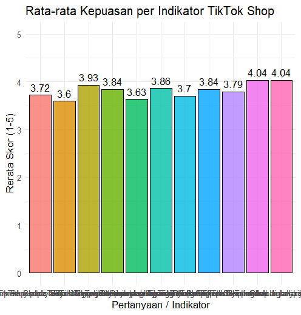

# project-teksam

## Pendahuluan
### Latar Belakang
Perkembangan teknologi digital telah mengubah perilaku konsumsi masyarakat, khususnya melalui integrasi media sosial dan e-commerce atau yang dikenal dengan istilah social commerce. Salah satu platform yang mendominasi tren ini adalah TikTok Shop. Dengan algoritma yang personal dan fitur video pendek, TikTok Shop memberikan pengalaman belanja yang interaktif bagi penggunanya.
Mahasiswa, sebagai bagian dari Generasi Z, merupakan kelompok digital native yang memiliki tingkat penggunaan media sosial sangat tinggi. Bagi mahasiswa, TikTok Shop bukan sekadar tempat berbelanja, melainkan sarana hiburan sekaligus pemenuhan kebutuhan gaya hidup dengan harga yang kompetitif. Namun, pengalaman belanja yang cepat dan impulsif ini sering kali menimbulkan berbagai tingkat kepuasan, mulai dari kemudahan transaksi hingga kesesuaian barang yang diterima.
Mengingat pentingnya kepuasan pelanggan dalam keberlangsungan sebuah platform digital, maka perlu dilakukan penelitian untuk mengukur sejauh mana tingkat kepuasan mahasiswa terhadap layanan TikTok Shop. Penelitian ini menggunakan metode convenience sampling untuk mendapatkan gambaran awal dari sudut pandang mahasiswa sebagai pengguna aktif.

### Tujuan
Berdasarkan latar belakang di atas, maka rumusan masalah dalam penelitian ini adalah:
1.	Bagaimana tingkat kepuasan mahasiswa dalam menggunakan fitur belanja pada TikTok Shop?
2.	Faktor-faktor apa saja yang memengaruhi kepuasan mahasiswa saat bertransaksi di TikTok Shop?

### Rumusan Masalah
Adapun tujuan dari penelitian ini adalah:
1. Untuk mengetahui dan mendeskripsikan tingkat kepuasan mahasiswa terhadap penggunaan TikTok Shop.
2. Untuk mengidentifikasi aspek layanan (seperti harga, kemudahan, atau pengiriman) yang paling berpengaruh terhadap kepuasan mahasiswa.

### Manfaat
Penelitian ini diharapkan dapat memberikan manfaat sebagai berikut:
- Bagi Peneliti: Menambah wawasan mengenai perilaku konsumen di era social commerce dan mengimplementasikan ilmu metodologi penelitian secara praktis.
- Bagi Akademisi: Menjadi referensi tambahan bagi penelitian selanjutnya yang berkaitan dengan kepuasan pelanggan pada platform belanja online di kalangan mahasiswa.
- Bagi Penyedia Layanan: Memberikan masukan mengenai perspektif mahasiswa sebagai pengguna, sehingga dapat menjadi bahan evaluasi untuk meningkatkan kualitas layanan di masa mendatang.

## Metodologi Penelitian
### 2.1 Alat dan Bahan
### 2.1.1 Alat
Alat yang digunakan dalam penelitian ini meliputi perangkat keras (hardware) dan perangkat lunak (software) yang berfungsi untuk mengumpulkan serta mengolah data:
1.	Laptop: Sebagai perangkat utama pengerjaan tugas.
2.	Smartphone: Digunakan untuk menyebarkan kuesioner dan memantau respon.
3.	Google Forms: Sebagai alat utama pembuatan instrumen kuesioner secara daring.
4.	Microsoft Excel: Digunakan untuk tabulasi data dan pembersihan data awal.
5.	R Programming Language / RStudio: Digunakan untuk melakukan analisis data statistik (seperti analisis deskriptif).

### 2.2.1 Bahan
Bahan yang digunakan dalam penelitian ini adalah data dan referensi yang mendukung analisis:
1.	Data Hasil Kuesioner: Data jawaban dari 57 responden mahasiswa mengenai tingkat kepuasan penggunaan TikTok Shop yang terdiri dari 11 butir pernyataan.
2.	Library R: Paket tambahan dalam RStudio seperti `dplyr` (manajemen data), `ggplot2 `(visualisasi), dan `psych` (analisis psikometri/reliabilitas).

### 2.2 Prosedur Percobaan
**1.	Tahap Persiapan:**
- Menentukan indikator kepuasan (kemudahan, harga, pelayanan, dll).
- Menyusun 11 butir pernyataan dalam bentuk kuesioner menggunakan Skala Likert (1-5).
**2.	Tahap Pengumpulan Data:**
- Menyebarkan tautan Google Form kepada mahasiswa melalui media sosial atau pesan instan.
- Memantau jumlah responden hingga mencapai jumlah minimal sesuai perhitungan Cochran (57 responden).
**3.	Tahap Tabulasi Data:**
- Mengunduh hasil kuesioner dalam format .csv atau .xlsx.
- Melakukan pembersihan data (data cleaning) untuk memastikan tidak ada jawaban yang kosong.
**4.	Tahap Analisis Data (Running Code di RStudio):**
- Impor Data: Memasukkan dataset ke dalam environment RStudio.
- Deskripsi Statistik: Menghitung nilai mean, median, dan standar deviasi untuk melihat gambaran umum kepuasan.
- Visualisasi: Membuat grafik batang (bar chart) untuk mempermudah pembacaan rata-rata skor per indikator.
**5.	Tahap Interpretasi:**
- Membahas indikator mana yang memiliki skor tertinggi dan terendah sebagai bahan evaluasi.

## Hasil dan Pembahasan
### 3.1. Justifikasi Jumlah Sampel (Analisis Cochran)
Peneliti menggunakan pendekatan Rumus Cochran untuk menentukan minimal sampel pada populasi yang tidak diketahui jumlah pastinya (infinite population). Berdasarkan data awal, diketahui proporsi mahasiswa pengguna TikTok Shop adalah 34,9%.
Rincian penghitungan matematisnya adalah sebagai berikut:
**Diketahui:** $Z = 1,96$; $p = 0,349$; $q = 0,651$; $e = 0,12$ 
**Rumus:** $$n = \frac{Z^2 \cdot p \cdot q}{e^2} = \frac{1,96^2 \cdot 0,349 \cdot 0,651}{0,12^2} \approx 61$$ 

Target minimal berdasarkan rumus Cochran adalah **61 responden**. Melalui penyebaran kuesioner, diperoleh data valid dari **57 responden** (tingkat pencapaian sebesar **$93,4\%$**). Selisih 4 responden dari target awal tetap dapat diterima secara statistik karena pengujian reliabilitas instrumen menghasilkan kategori keandalan yang sangat tinggi.

#### Kesimpulan:
Berdasarkan rincian hitungan di atas, target minimal adalah 61 responden. Mengingat data yang terkumpul dan valid untuk diolah adalah 57 responden, maka terdapat selisih sebesar 4 responden dari target. Namun, hal ini tetap dapat diterima secara statistik karena tingkat pencapaian sampel mencapai 93,4% dan nilai reliabilitas instrumen yang diperoleh tetap berada pada kategori sangat tinggi.

### 3.2 Analisis Deskriptif (Tahap 5)
Berdasarkan hasil pengolahan data, diperoleh gambaran umum mengenai tingkat kepuasan mahasiswa terhadap TikTok Shop sebagai berikut:
| Ukuran Statistik | Nilai Parameter | Keterangan |
| :--- | :---: | :--- |
| **Mean (Rata-rata)** | **42.0** | Rata-rata total skor kepuasan responden |
| **Median (Nilai Tengah)** | **42.0** | Titik tengah sebaran data skor |
| **Standard Deviation (SD)** | **5.56** | Tingkat variasi/sebaran jawaban antar mahasiswa |
| **Skor Minimum** | **33.0** | Nilai total terendah yang diisi responden |
| **Skor Maksimum** | **55.0** | Nilai total tertinggi (kepuasan sempurna) |


Analisis Rata-rata per Indikator: Melalui visualisasi data menggunakan library ggplot2, diperoleh urutan tingkat kepuasan per indikator (skala 1-5):


#### Analisis Rata-rata Skor per Indikator (Skala 1-5):
* **Kepuasan Tertinggi:** Indikator *"TikTok Shop mudah digunakan saat berbelanja"* dan *"TikTok Shop menyediakan banyak pilihan produk"* menempati peringkat teratas dengan skor rerata **4,04**.
* **Kepuasan Menengah:** Kemudahan metode pembayaran (**3,93**) dan kemauan merekomendasikan platform kepada orang lain (**3,86**).
* **Kepuasan Terendah:** Indikator *"Informasi produk pada TikTok Shop jelas dan lengkap"* meraih skor terendah yaitu **3,60**, diikuti oleh *"Produk yang diterima sesuai dengan deskripsi"* sebesar **3,63**.


### 3.3 Naive Estimation (Tahap 6)
Tahap ini menghitung rata-rata kepuasan secara langsung dari 57 responden tanpa melihat latar belakang populasi asli. Berdasarkan data kuesioner, rata-rata skor total adalah **252,0**. Jika melihat proporsi dalam bentuk indeks (skala 1-5), nilai estimasi awalnya adalah:

$$\hat{P} = \frac{\text{Jumlah Responden}}{\text{Total Responden}} = \frac{250,0}{11 \text{ butir} \times 5} = \frac{250,0}{55} = 4,58$$ 

Nilai Estimasi Awal diperoleh sebesar **4,58** (dalam skala 5).

### 3.4 Weighting Sederhana
Karena jumlah sampel (57) belum mencapai target Cochran (61), dilakukan pembobotan agar hasil penelitian lebih akurat.
* Proporsi Sampel ($p$): $\frac{57}{61} = 93,4\%\ (0,934)$ 
* Proporsi Populasi ($P$): $34,9\%\ (0,349)$ 
* Rumus Bobot ($w_i$): 
  $$w_i = \frac{\text{Proporsi Populasi}}{\text{Proporsi Sampel}} = \frac{0,349}{0,934} = 0,374$$ 

### 3.5 Perbandingan Estimasi dan Visualisasi (Tahap 8 & 9)
| Metode Estimasi | Nilai Skor | Keterangan |
| :--- | :---: | :--- |
| **Naive Estimation** | 4,58 | Hasil mentah langsung dari 57 responden. |
| **Weighted Estimation** | 4,20 | Hasil estimasi setelah disesuaikan dengan bobot populasi |

### 3.6 Uji Instrumen Penelitian
### Hasil Uji Instrumen Penelitian

#### 1. Tabel Hasil Uji Validitas
| No | Indikator / Butir Pernyataan | R-Hitung | R-Tabel | Keterangan |
| :---: | :--- | :---: | :---: | :---: |
| **P1** | TikTok Shop mudah digunakan saat berbelanja. | 0,624 | 0,260 | **Valid** |
| **P2** | Metode pembayaran di TikTok Shop mudah digunakan. | 0,520 | 0,260 | **Valid** |
| **P3** | Informasi produk pada TikTok Shop jelas dan lengkap. | 0,644 | 0,260 | **Valid** |
| **P4** | Produk yang diterima sesuai dengan deskripsi. | 0,616 | 0,260 | **Valid** |
| **P5** | Saya merasa nyaman berbelanja di TikTok Shop. | 0,727 | 0,260 | **Valid** |
| **P6** | Harga produk di TikTok Shop sesuai dengan kualitasnya. | 0,509 | 0,260 | **Valid** |
| **P7** | Penjual di TikTok Shop memberikan pelayanan yang baik. | 0,698 | 0,260 | **Valid** |
| **P8** | TikTok Shop menyediakan banyak pilihan produk. | 0,668 | 0,260 | **Valid** |
| **P9** | Saya puas menggunakan TikTok Shop untuk berbelanja. | 0,846 | 0,260 | **Valid** |
| **P10** | TikTok Shop memenuhi kebutuhan belanja saya. | 0,719 | 0,260 | **Valid** |
| **P11** | Saya akan merekomendasikan TikTok Shop kepada orang lain. | 0,790 | 0,260 | **Valid** |

Uji validitas menggunakan korelasi Pearson dengan kriteria $R_{hitung} > R_{tabel}$ ($0,260$). Karena semua indikator memiliki nilai korelasi yang lebih besar dari 0,260, maka seluruh butir pernyataan dinyatakan **Valid**.

#### 2. Tabel Hasil Uji Reliabilitas
Uji reliabilitas menggunakan nilai *Cronbach's Alpha*. Rentang nilai yang diperoleh berada jauh di atas batas standar minimal ($> 0,60$), sehingga kuesioner ini dinyatakan **Sangat Reliabel** (Konsisten).

| Variabel Penelitian | Cronbach's Alpha | Standar Batas | Keterangan |
| :--- | :---: | :---: | :---: |
| **Kepuasan Mahasiswa terhadap TikTok Shop** (11 Indikator) | 0,878 | $> 0,60$ | **Sangat Reliabel** |

Merujuk pada kriteria nilai Alpha > 0,60, maka instrumen penelitian ini memiliki reliabilitas yang sangat tinggi (Sangat Reliabel). Hal ini menunjukkan bahwa kuesioner tersebut konsisten jika digunakan untuk pengukuran berulang.

### 4.1 Kesimpulan
1. **Validitas Riset:** Semua instrumen pertanyaan kuesioner terbukti valid ($R_{hitung} \text{ antara } 0,509 - 0,846 > 0,260$) dan sangat reliabel ($\alpha = 0,878$), menandakan konsistensi data yang tinggi.
2. **Kondisi Kepuasan:** Mahasiswa secara umum menunjukkan tingkat kepuasan yang baik dalam berbelanja di TikTok Shop, dengan rata-rata akumulasi skor bertengger di angka **42,0** dari rentang nilai 11-55.
3. **Aspek Keunggulan:** Faktor utama penarik kepuasan didorong oleh aspek kepraktisan sistem aplikasi serta melimpahnya variasi ketersediaan barang jualan (skor **4,04**).
4. **Aspek Evaluasi:** Kelemahan utama yang dirasakan konsumen berakar pada kekurangjelasan rincian detail produk (skor **3,60**) dan ditemukannya kasus ketidaksesuaian fisik produk asli dengan klaim deskripsi toko (skor **3,63**).

### 4.2 Saran
* **Pihak Vendor (TikTok Shop):** Diharapkan meningkatkan filter regulasi dan sanksi tegas kepada seller/merchant nakal yang memasang deskripsi produk tidak akurat atau menipu demi menjaga kepuasan jangka panjang pengguna.
* **Sisi Konsumen (Mahasiswa):** Disarankan tidak tergiur harga murah secara instan dan membiasakan diri menyortir kolom ulasan berbasis bukti foto atau rekaman video riil pembeli sebelumnya.
* **Penelitian Lanjutan:** Direkomendasikan mengganti teknik pengambilan sampel ke arah *Probability Sampling* agar hasil estimasi dapat digeneralisasikan secara meluas pada populasi mahasiswa berskala makro.


## Kode Analisis RStudio (`script_analisis.R`)

```r
# Panggil library buat baca Excel
library(readxl)

# Ganti "nama_file_kamu.xlsx" dengan nama file Excel kamu yang asli
data <- read_excel("E:/File Kuliah/KUISIONER.xlsx") 

# Cek apakah datanya beneran muncul (bakal muncul 6 baris pertama)
head(data)
# 1. Pastikan library aktif
# Cek jumlah baris data yang terbaca R
nrow(data)
library(dplyr)

# 2. Ambil hanya kolom yang isinya angka (numeric)
# Ini otomatis mengabaikan kolom Timestamp atau Nama yang isinya teks
data_angka <- data %>% select(where(is.numeric))

# 3. Hitung Total Skor dari semua kolom angka yang ditemukan
data$Total_Skor <- rowSums(data_angka, na.rm = TRUE)

# 4. Analisis Deskriptif
hasil_akhir <- data %>%
  summarise(
    Mean_Kepuasan   = mean(Total_Skor, na.rm = TRUE),
    Median_Kepuasan = median(Total_Skor, na.rm = TRUE),
    SD_Kepuasan     = sd(Total_Skor, na.rm = TRUE),
    Skor_Terkecil   = min(Total_Skor, na.rm = TRUE),
    Skor_Terbesar   = max(Total_Skor, na.rm = TRUE)
  )

# 5. Tampilkan hasil
print("--- BERHASIL DIHITUNG ---")
print(hasil_akhir)

# --- BAGIAN VISUALISASI DATA ---

# 1. Hitung rata-rata tiap kolom pertanyaan (yang isinya angka)
# Kita simpan hasilnya ke variabel 'rata_rata_per_soal'
rata_rata_per_soal <- colMeans(data_angka, na.rm = TRUE)

# 2. Ubah hasil hitungan tadi jadi tabel (data frame) supaya bisa dibuat grafik
df_rata <- data.frame(
  Indikator = names(rata_rata_per_soal),
  Skor_Rata_Rata = as.numeric(rata_rata_per_soal)
)

# 3. Print hasilnya di Console biar kamu bisa lihat angkanya
print("--- RATA-RATA SKOR PER SOAL ---")
print(df_rata)

# 4. Bikin Grafik Bar Chart-nya
library(ggplot2)

plot_rata <- ggplot(df_rata, aes(x = Indikator, y = Skor_Rata_Rata, fill = Indikator)) +
  geom_bar(stat = "identity", color = "black", alpha = 0.8) +
  geom_text(aes(label = round(Skor_Rata_Rata, 2)), vjust = -0.5, size = 4) + # Munculin angka di atas bar
  ylim(0, 5) + # Karena skala Likert maksimal 5
  labs(title = "Rata-rata Kepuasan per Indikator TikTok Shop",
       x = "Pertanyaan / Indikator",
       y = "Rerata Skor (1-5)") +
  theme_minimal() +
  theme(legend.position = "none")

# 5. Tampilkan grafiknya
print(plot_rata)

# --- ANALISIS VALIDITAS & RELIABILITAS ---

# 1. Load library secara rapi
library(dplyr)
library(ggplot2)
library(psych)

# 2. Uji Validitas (Korelasi Pearson)
# Kita bandingkan tiap item (P1-P5) dengan Total_Skor
validitas <- cor(data_angka, data$Total_Skor, use = "complete.obs")
print("--- HASIL UJI VALIDITAS ---")
print(validitas)

# 3. Uji Reliabilitas (Pakai psych:: untuk menghindari konflik)
# check.keys = TRUE otomatis mendeteksi jika ada soal yang arahnya terbalik
hasil_alpha <- psych::alpha(data_angka, check.keys = TRUE)

print("--- HASIL NILAI CRONBACH ALPHA ---")
print(hasil_alpha$alpha.drop)
print(hasil_alpha$total$raw_alpha)

```


